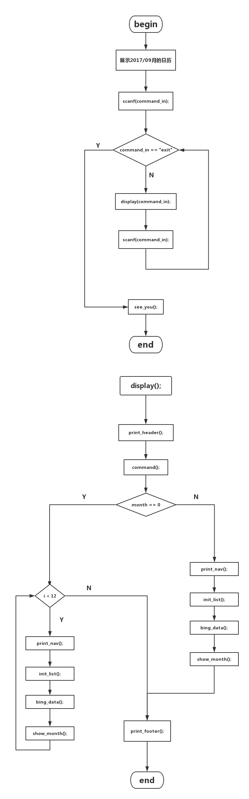

# 使用到的库
+   stdio.h
+   time.
+   windows.h
+   stdlib.h
+   string.h
+   conio.h

# 设计思路

主要通过一个命令行工具读取用户的输入命令，依据命令来调用子模块实现万年历的翻页功能和跳转指定日期。

通过顺序表来动态的存放一个的相关数据。

# 模块划分
## main 模块

读取控制台输入的字符串，判断是否是结束命令，是，结束程序，否，调用命令行模块

## 命令行工具

解析用户输入的命令，并返回一个数组。

## 逻辑模块

处理得到一个月的日期数据

+   闰年判断模块
+   星期模块

## 输出模块

将得到的日期数据数据，输出

+   打印头 
+   打印导航栏
+   打印脚注

## 数据模块

+   初始顺序表
+   绑定数据到顺序表
# 具体实现

因为一个月最多 31 天，如现在的日历所示都是 7 * 5 或者 7 * 6 的表格形式。

如果想要输出一个月的日历的话，只要根据一个月的第一天的具体信息就可以推导出整个月的日历信息。

重点在于实现得到指定月的第一天信息。

# 最终实现

